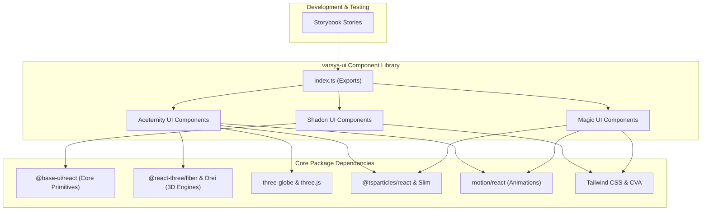

# System Diagram — varsys-ui

Below is the dependency and architecture diagram for the `@varsys/ui` package.

```mermaid
graph TD
    subgraph App ["varsys-ui Component Library"]
        index["index.ts (Exports)"]
        shadcn["Shadcn UI Components"]
        aceternity["Aceternity UI Components"]
        magicui["Magic UI Components"]
    end

    subgraph Dependencies ["Core Package Dependencies"]
        baseui["@base-ui/react (Core Primitives)"]
        r3f["@react-three/fiber & Drei (3D Engines)"]
        three["three-globe & three.js"]
        tsparticles["@tsparticles/react & Slim"]
        motion["motion/react (Animations)"]
        tailwind["Tailwind CSS & CVA"]
    end

    subgraph Storybook ["Development & Testing"]
        stories["Storybook Stories"]
    end

    %% Wiring
    index --> shadcn
    index --> aceternity
    index --> magicui

    shadcn --> baseui
    shadcn --> tailwind
    
    aceternity --> motion
    aceternity --> r3f
    aceternity --> three
    aceternity --> tsparticles

    magicui --> motion
    magicui --> tsparticles
    magicui --> tailwind

    stories --> index
```
